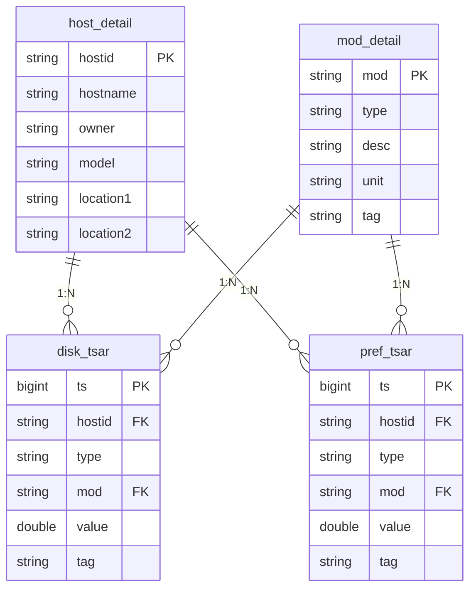

# E-R Diagram

## 关联关系

| 左表 | 右表 | 外键 | 关系 | 含义 |
|---|---|---|---|---|
| `host_detail` | `disk_tsar` | `hostid` | 1:N | 一台主机 → 多条磁盘监控记录 |
| `host_detail` | `pref_tsar` | `hostid` | 1:N | 一台主机 → 多条性能监控记录 |
| `mod_detail` | `disk_tsar` | `mod` | 1:N | 一个指标定义 → 多条磁盘数据点 |
| `mod_detail` | `pref_tsar` | `mod` | 1:N | 一个指标定义 → 多条性能数据点 |

### 结构说明

- **`host_detail`** 与 **`mod_detail`** 是**维度表**，分别描述"哪台机器"和"什么指标"
- **`disk_tsar`** 与 **`pref_tsar`** 是**事实表**，存储按时间采集的监控数据
- 两张事实表结构镜像，通过 `type` 字段区分 `disk` / `pref` 两类数据
- `(ts, hostid, mod)` 构成两张 tsar 表的联合主键
