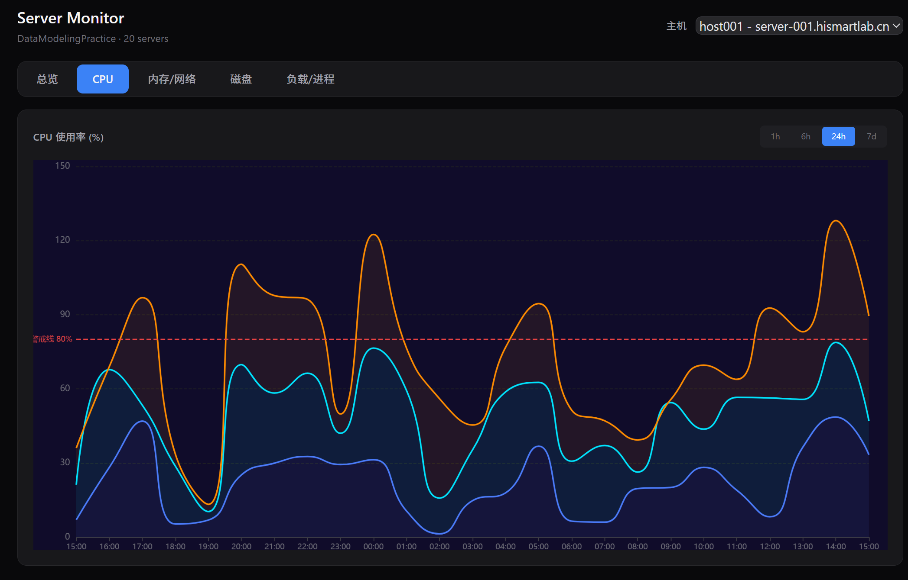
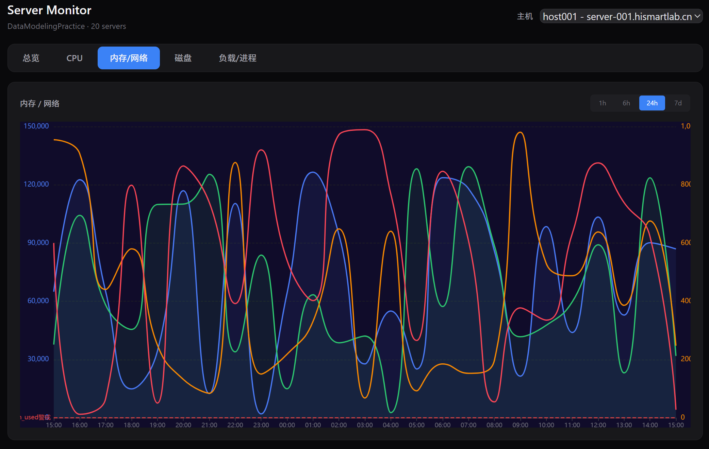

<div align="center">

# 🖥️ Server Monitor — 数据建模实战

**Express + ECharts 驱动的服务器监控面板 · 5000+ 行采集数据 · 时序可视化**

<p>

[](https://nodejs.org)
[](https://expressjs.com)
[](https://echarts.apache.org)
[](https://tailwindcss.com)
[](LICENSE)


</p>

---

</div>

## ✨ 亮点速览

| | 特性 | 说明 |
|--|------|------|
| 🎯 | **数据建模** | 3 张关联表 · 20 台主机 · 55 个监控指标 |
| 📊 | **时序可视化** | ECharts 折线图 · 多维度钻取 · 时间范围切换 |
| 🩺 | **智能健康评估** | 综合评分算法 · 分级告警 · 扣分原因追溯 |
| ⚡ | **零依赖数据库** | 纯文件存储 · `node server.js` 一键启动 |

## 🚀 快速开始

```bash
node server.js
# → http://localhost:3000
```

> 数据已内置（`host_detail.dat` / `mod_detail.dat` / `disk_tsar.dat` / `pref_tsar.dat`），开箱即用。

## 🎨 监控面板

<div align="center">

| 总览页 | CPU 监控 | 内存 / 网络 |
|:------:|:--------:|:----------:|
|  |  |  |

</div>

### 面板功能

- **总览** — 主机分布 · 硬件型号 · 健康评分 · 告警简报 · 主机明细
- **CPU** — `cpu_user` / `cpu_sys` / `cpu_wait` / `cpu_idle` 堆叠面积图
- **内存/网络** — 双纵轴：内存用量(MB) + 网络带宽(MB/s)
- **磁盘** — 按 `sda`~`sde` 切换 · util / await / read / write
- **负载/进程** — 双纵轴：系统负载 + 进程统计
- **时间范围** — 1h / 6h / 24h / 7d 一键切换
- **健康评分** — 多维度加权算法 · 实时扣分原因

## 🧱 数据模型

```
┌─────────────┐     hostid     ┌──────────────────┐
│ host_detail │◄───────────────│   tsar_detail     │
│  (20 台)    │   1 ──── N     │ (disk + pref)     │
└─────────────┘                │  ~79,200 条       │
                               └────────┬─────────┘
                                        │ mod
                                        ▼
                               ┌──────────────────┐
                               │   mod_detail      │
                               │  (55 个指标)      │
                               └──────────────────┘
```

### 数据一览

| 文件 | 记录数 | 采集频率 | 时间范围 |
|------|--------|----------|----------|
| `host_detail.dat` | 20 | — | — |
| `mod_detail.dat` | 55 | — | — |
| `disk_tsar.dat` | 12,000 | 每 5 分钟 | 2026-07-01 起 |
| `pref_tsar.dat` | 67,200 | 每小时 | 2026-07-01 起 |

<details>
<summary><b>📖 详细表结构</b>（点击展开）</summary>

### host_detail

| 字段 | 类型 | 含义 |
|------|------|------|
| hostid | string | 主机 ID（PK） |
| hostname | string | FQDN · `*.hismartlab.cn` |
| owner | string | 负责人 |
| model | string | 硬件型号 |
| location1 | string | 机房（A~E） |
| location2 | string | 机柜（01~12） |

### mod_detail

| 字段 | 类型 | 含义 |
|------|------|------|
| mod | string | 指标代码（PK） |
| type | string | `disk` / `pref` |
| desc | string | 中文说明 |
| unit | string | 单位 |
| tag | string | 分类标签 |

**磁盘指标** — sda~sde × 7 = 35 个

| 后缀 | 说明 | 单位 |
|------|------|------|
| `_rqm` | 合并读请求 | req/s |
| `_read` | 读取扇区数 | sectors/s |
| `_write` | 写入扇区数 | sectors/s |
| `_avgrq` | 平均请求扇区 | sectors |
| `_await` | 平均 I/O 等待 | ms |
| `_util` | 磁盘使用率 | % |
| `_svctm` | 平均服务时间 | ms |

**性能指标** — 5 类 20 个

| 分类 | 数量 | 指标示例 |
|------|------|----------|
| CPU | 5 | `cpu_user` · `cpu_sys` · `cpu_usage` |
| 内存 | 5 | `mem_used` · `mem_free` · `mem_swap` |
| 网络 | 4 | `net_in` · `net_out` · `net_pktin` |
| 负载 | 3 | `load1` · `load5` · `load15` |
| 进程 | 3 | `proc_run` · `proc_block` · `proc_total` |

### tsar_detail

| 字段 | 类型 | 含义 |
|------|------|------|
| ts | long | 时间戳（ms） |
| hostid | string | → `host_detail` |
| type | string | `disk` / `pref` |
| mod | string | → `mod_detail` |
| value | string | 采集值 |
| tag | string | → `mod_detail.tag` |

</details>

## 🏗 架构设计

```
dat/                        public/
  host_detail.dat  ──────────┐
  mod_detail.dat   ──────────┤
  disk_tsar.dat    ──────────┤     ┌──────────────┐
  pref_tsar.dat    ──────────┼────►│  server.js    │
                              │     │  (Express)    │
server.js ────────────────────┘     └──────┬───────┘
                                           │ REST API
                                    ┌──────┴───────┐
                                    │  index.html   │
                                    │  ECharts +    │
                                    │  TailwindCSS  │
                                    └──────────────┘
```

## 🛠 技术栈

| 层 | 技术 |
|----|------|
| **后端** | Node.js 18+ · Express 4.21 · ES Modules |
| **前端** | ECharts 5 · TailwindCSS v4 · 原生 JS |
| **数据** | Tab 分隔文件 `.dat` · 内存加载 |
| **可视化** | 折线图 · 饼图 · 仪表盘 · 堆叠面积图 |

## 🧪 告警规则

| 指标 | 警告阈值 | 严重阈值 |
|------|----------|----------|
| CPU 使用率 | > 80% | > 90% |
| CPU IO 等待 | > 30% | — |
| 内存使用 | > 800 GB | > 950 GB |
| 磁盘利用率 | > 85% | > 95% |
| load1 | > 20 | > 30 |

## 📁 项目结构

```
├── server.js              # Express 服务器 + API
├── package.json           # 项目配置
├── public/
│   └── index.html         # 监控面板（ECharts + Tailwind）
├── host_detail.dat        # 主机信息（20 台）
├── mod_detail.dat         # 指标字典（55 个）
├── disk_tsar.dat          # 磁盘采集（12,000 条）
├── pref_tsar.dat          # 性能采集（67,200 条）
├── import.sql             # SQL 导入脚本
├── generate_csv.js        # CSV 生成脚本
├── screenshot-overview.png
├── screenshot-cpu.png
└── screenshot-memnet.png
```
